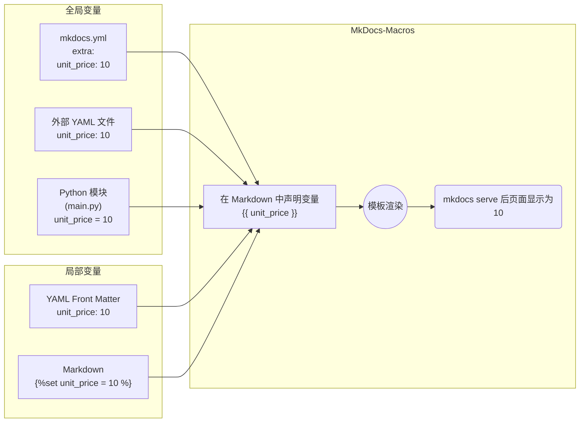

# MkDocs-Macros

## 介绍

[Mkdocs-Macros](https://mkdocs-macros-plugin.readthedocs.io/en/latest/) 是一个插件/迷你框架，使 MkDocs 网站的贡献者可以轻松生成更丰富、更漂亮的页面。它可以做两件事：

1. 将 Markdown 页面转换为 Jinja2 模板：
    1. 使用环境或自定义变量
    2. 调用预定义或自定义宏（函数，一般定义在 Python 模块中）
    3. 利用标准或自定义过滤器
2. 替换 MkDocs 插件以执行多种任务：例如操作导航、在生成 html 页面后添加文件等。

## 变量（Variables）

变量是一个预定义的值。

变量可以用五种不同的方式定义：



!!! warning "注意"

    局部变量只能在特定 Markdown 页面内访问。无法从 python 代码访问它们。

=== "第一种"

    === "mkdocs.yml"

        ```
        extra:
            price: 12.50
            company:
                name: Acme
                address: ....
                website: www.acme.com
        ```

        !!! info "说明"
            extra 部分中只能使用文字（字符串或数字）。

=== "第二种"

    === "mkdocs.yml"

        ```
        plugins:
          - macros:
              include_yaml:
                - docs\assets\variables.yml
        ```

    === "variables.yml"

        ```
        price: 12.50
        company:
            name: Acme
            address: ....
            website: www.acme.com
        ```

=== "第三种"

    === "mkdocs.yml"

        ```
        plugins:
        - macros:
            module_name: main
        ```

    === "main.py"

        ```
        import XXX

        def define_env(env):
            """
            这是用于定义变量的钩子
            变量: 包含环境变量的字典
            """

            你的 python 代码。。。。。。

            # 添加到 Markdown 页面的变量字典中：
            env.variables['price'] = "12.50"
            ...
        ```

=== "第四种"

    === "Markdown"

        ```
        # 在 Markdown 中使用 set 关键字
        
        
        ```

=== "第五种"

    === "YAML Front Matter"

        ```
        ---
        price: 12.50
        company:
            name: Acme
            address: ....
            website: www.acme.com
        ---
        ```

        !!! info "说明"

            可以通过两种方式访问​​ YAML FrontMatter 的内容：

            1. 按名称，例如 {{ price }} 和 {{ company.name }}
            2. 或者 {{ page.meta.price }} 和 {{ page.meta.company.name }}

=== "Markdown"

    ```
    The price of the product is {{ price }}.

    See [more information on the website]({{ company.website }}).

    See <a href="{{ company.website }}">more information on the website</a>.
    ```

## 宏（Macros）

宏即 Python 函数。这些函数将在 markdown 页面中的 jinja2 片段中使用。宏应该返回一个字符串，可以是纯文本、markdown 或 HTML。在 Markdown 页面中对宏的每次调用都将被该结果替换。

## 过滤器（Filters）

自定义过滤器是 Jinja2 的概念。它本质上是一个使用不同语法的 Python 函数，例如 `{{ 'my text ' | uppercase }}`（假设有一个名为 uppercase 的自定义函数并声明为过滤器）。就像宏一样，过滤器应该返回一个字符串，可以是纯文本、Markdown 或 HTML。

## 模块（Modules）

模块是宏、过滤器和变量的库。每个模块必须包含一个`define_env()`函数，其中包含声明。

默认情况下，Python 代码必须放在主站项目目录中的一个 main.py 文件中 (通常在 mkdocs.yml 文件同级目录)。

可以通过向 mkdocs.yml 文件添加 module_name 条目来更改该模块的名称（无需添加 .py 后缀）

```
plugins:
  - macros:
        module_name: main
```

### 注册变量、宏和过滤器

```
"""
Mkdocs-macros 模块的基本示例
"""

import math

def define_env(env):
    """
    这是定义变量、宏和过滤器的钩子

    - 变量：包含环境变量的字典
    - 宏：一个装饰函数，用于声明一个宏。
    - 过滤器：带有一个或多个参数的函数，用于执行转换
    """

    # 添加到 markdown 页面的变量字典中:
    env.variables['baz'] = "John Doe"

    # 可以将 env.variables 视为一个命名空间，
    #       使用点语法:
    env.variables.baz = "John Doe"

    @env.macro
    def bar(x):
        return (2.3 * x) + 7

    # 可以用不同的名称声明一个宏:
    def f(x):
        return x * x
    env.macro(f, 'barbaz')

    # 或者导出某个预定义函数
    env.macro(math.floor) # will be exported as 'floor'


    # 创建一个 jinja2 过滤器
    @env.filter
    def reverse(x):
        "反转字符串（和大写字母）"
        return x.upper()[::-1]
```

!!! warning "注意"

    如果发生冲突，Python 模块中声明的变量将覆盖用户在 YAML 文件 ( extra ) 中创建的变量。这是一项安全功能，以确保该文件的维护者不会意外破坏程序员在模块中定义的设置。

### env 对象

以下是该对象的常用属性（常量）或函数列表：

条目|类型|描述
---|---|---
`variables`|_attribute_|作为命名空间，包含了在 Markdown 页面中使用 `{{ ... }}` 符号表示的变量和宏，这个字典会根据配置文件中的 extra 部分的值进行初始化（还可以选择性地使用外部 YAML 文件进行初始化）。这个对象也可以通过点表示法进行访问；例如，`env.variables['foo']` 等同于 `env.variables.foo`。
`macro`|_function_|一个装饰器函数，你可以用它来声明一个 Python 函数作为 Jinja2 可调用函数（在 MkDocs 中称为'macro'）。
`filters`|_attribute_|一个 Jinja2 过滤器的列表（默认值为 None）。
`filter`|_function_|一个用于声明 Python 函数为 Jinja2 自定义过滤器的装饰器。
`project_dir`|_attribute_|MkDocs 项目的源代码目录（用于查找或包含其他文件）。
`conf`|_attribute_|mkdocs.yaml 配置文件的内容。
`config`|_attribute_|这是一个有用的对象；它包含了 MkDocs 的全局上下文[^1]。
`page`|_attribute_|Markdown 页面的信息（例如标题等）。

### 访问配置文件

可以从整个配置文件（ `mkdocs.yaml` ）中获取信息，例如 `site_description` 、 `theme` 、 `copyright` 等等。

 `env` 对象的 `conf` 属性包含了这些信息。

例如，可以定义这样的函数：

```
@env.macro
def site_info():
    "Return general info on the website (name, description and theme)"
    info = (env.conf['site_name'], env.conf['site_description'],
            env.conf['theme'].name)
    return "%s/%s (theme: %s)" % info
```

!!! warning "注意"

    请注意，通常被称为配置的内容在该模块中被称为 `env.conf` 。这是因为在 `BasePlugin` 类中已经有 `env.config` 属性了。

    事实上，还可以在 `env.variables.config` 下找到相同的对象；换句话说，在Markdown页面中，可以通过 `{{ config }}` 访问它。

!!! info "说明"

    为了获取文档目录（docs），您可以在Python模块中使用以下值： `env.conf['docs_dir']` 。


## 控制结构

### 条件

```
### 标题

第一个版本：......

第二个版本：......

```

### 循环

```
### 用户列表



1. {{ user }}

```
