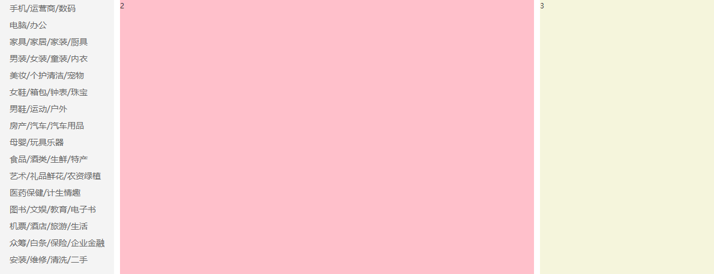

# 最终效果



## 思路

左边无序列表，右边定义列表。子绝父相。  
左边鼠标悬浮在列表项上，背景占满且左侧有间距，所以要用 padding。  
右边鼠标悬浮出现，相对于`<ul>`绝对定位。`<dt>, <dl>`分别左浮。  

=== "Left div"

    !!! info "注意点"
        - 如果几个元素之间上下间距相等，那么行高可以设为：元素自身高度 ＋（上边距+下边距）➗ 2
        - 如果选中一个`<li>`时背景色铺满，同时要调整间距，应该用 padding，否则背景色会铺不满

=== "Right div"

    !!! info "注意点"
        - 出现 border 属性时，如果要调整内容与边距之间的间距，则需要用 padding 而非 margin

## 源码

```html
<div class="main-content">
    <div class="container clearfix">
        <ul class="side-nav leftfix">
            <li>
                <a href="#">手机/运营商/数码</a>
                <div class="second-menu">
                    <dl class="clearfix">
                        <dt><a href="#">电子书刊</a></dt>
                        <dd><a href="#">电子书</a></dd>
                        <dd><a href="#">网络原创</a></dd>
                        <dd><a href="#">数字杂志</a></dd>
                        <dd><a href="#">多媒体图书</a></dd>
                    </dl>
                    <dl class="clearfix">
                        <dt><a href="#">音像</a></dt>
                        <dd><a href="#">音乐</a></dd>
                        <dd><a href="#">影视</a></dd>
                        <dd><a href="#">教育音像</a></dd>
                    </dl>
                    <dl class="clearfix">
                        <dt><a href="#">英文原版</a></dt>
                        <dd><a href="#">少儿</a></dd>
                        <dd><a href="#">商务投资</a></dd>
                        <dd><a href="#">英语学习考试</a></dd>
                        <dd><a href="#">文学</a></dd>
                        <dd><a href="#">传记</a></dd>
                        <dd><a href="#">励志</a></dd>
                    </dl>
                    <dl class="clearfix">
                        <dt><a href="#">文艺</a></dt>
                        <dd><a href="#">小说</a></dd>
                        <dd><a href="#">文学</a></dd>
                        <dd><a href="#">青春文学</a></dd>
                        <dd><a href="#">传记</a></dd>
                        <dd><a href="#">艺术</a></dd>
                    </dl>
                    <dl class="clearfix">
                        <dt><a href="#">少儿</a></dt>
                        <dd><a href="#">胎教</a></dd>
                        <dd><a href="#">0-2岁</a></dd>
                        <dd><a href="#">3-6岁</a></dd>
                        <dd><a href="#">7-10岁</a></dd>
                        <dd><a href="#">11-14岁</a></dd>
                    </dl>
                    <dl class="clearfix">
                        <dt><a href="#">人文社科</a></dt>
                        <dd><a href="#">历史</a></dd>
                        <dd><a href="#">哲学</a></dd>
                        <dd><a href="#">国学</a></dd>
                        <dd><a href="#">政治/军事</a></dd>
                        <dd><a href="#">法律</a></dd>
                        <dd><a href="#">人文社科</a></dd>
                        <dd><a href="#">心理学</a></dd>
                        <dd><a href="#">文化</a></dd>
                        <dd><a href="#">社会科学</a></dd>
                    </dl>
                    <dl class="clearfix">
                        <dt><a href="#">经管励志</a></dt>
                        <dd><a href="#">经济</a></dd>
                        <dd><a href="#">金融与投资</a></dd>
                        <dd><a href="#">管理</a></dd>
                        <dd><a href="#">励志与成功</a></dd>
                    </dl>
                    <dl class="clearfix">
                        <dt><a href="#">生活</a></dt>
                        <dd><a href="#">健康与保健</a></dd>
                        <dd><a href="#">家庭与育儿</a></dd>
                        <dd><a href="#">旅游</a></dd>
                        <dd><a href="#">烹饪美食</a></dd>
                    </dl>
                    <dl class="clearfix">
                        <dt><a href="#">科技</a></dt>
                        <dd><a href="#">工业技术</a></dd>
                        <dd><a href="#">科普读物</a></dd>
                        <dd><a href="#">建筑</a></dd>
                        <dd><a href="#">医学</a></dd>
                        <dd><a href="#">科学与自然</a></dd>
                        <dd><a href="#">计算机与互联网</a></dd>
                        <dd><a href="#">电子通信</a></dd>
                    </dl>
                    <dl class="clearfix">
                        <dt><a href="#">教育</a></dt>
                        <dd><a href="#">中小学教辅</a></dd>
                        <dd><a href="#">教育与考试</a></dd>
                        <dd><a href="#">外语学习</a></dd>
                        <dd><a href="#">大中专教材</a></dd>
                        <dd><a href="#">科学与自然</a></dd>
                        <dd><a href="#">字典词典</a></dd>
                    </dl>
                    <dl class="clearfix">
                        <dt><a href="#">艺术与收藏</a></dt>
                        <dd><a href="#">经济管理</a></dd>
                        <dd><a href="#">文化与艺术</a></dd>
                    </dl>
                    <dl class="clearfix">
                        <dt><a href="#">其他</a></dt>
                        <dd><a href="#">工具书</a></dd>
                        <dd><a href="#">杂志期刊</a></dd>
                        <dd><a href="#">套装书</a></dd>
                        <dd><a href="#">打折图书</a></dd>
                    </dl>
                </div>
            </li>
```

```css
.main-content .side-nav {
    width: 190px;
    height: 458px;
    background-color: #f4f4f4;
    position: relative;
}

.main-content .side-nav li {
    font-size: 14px;
    color:#333;
    /* 除了使用margin控制边距，还可以计算行高 */
    /* margin: 7px 0 7px 16px; */
    /* height: 28px; */
    line-height: 28px;
    /* 悬浮出现背景色，所以不用margin用padding */
    padding-left: 16px;
}

.main-content .side-nav li:hover,
.main-content .side-nav li:hover>a {
    background-color: #DD302D;
    color: white;
}

/* 先定义好尺寸和位置隐藏起来 */
.main-content .side-nav .second-menu {
    width: 680px;
    height: 458px;
    position: absolute;
    top: 0;
    left: 190px;
    padding-left: 20px;
    background-color: white;
    display: none;
}

/* 当鼠标悬浮在<li>上时再出现 */
.main-content .side-nav li:hover .second-menu {
    display: block;
}

.second-menu dl {
    height: 36px;
    line-height: 36px;
}

.second-menu dl:first-of-type {
    margin-top: 10px;
}

/* 让定义列表横向排列 */
.second-menu dt {
    float: left;
    width: 70px;
    height: 20px;
    margin-right: 10px;
    font-weight: bold;
}

.second-menu dd {
    float: left;
}

.second-menu dd a {
    border-left: 1px solid #666;
    /* 小细节 */
    padding: 0 10px;
}
```