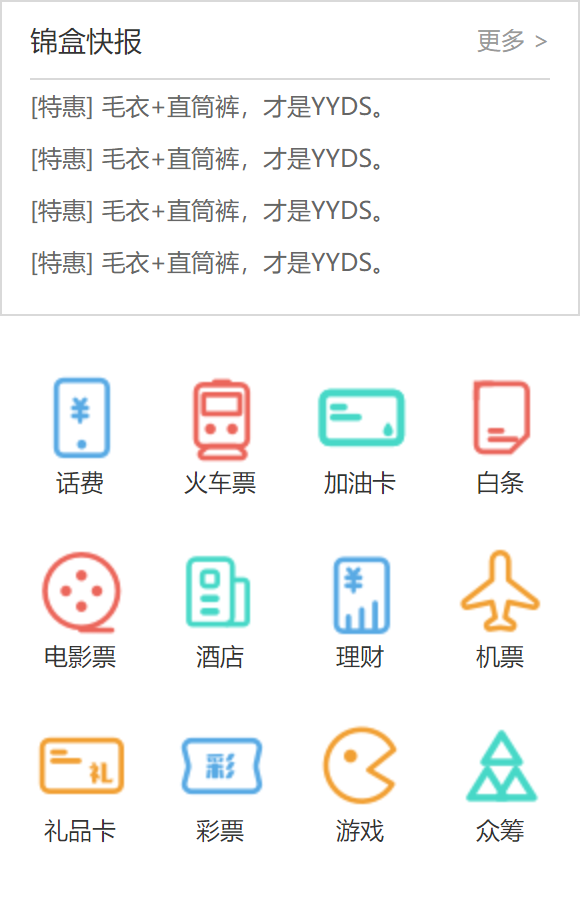

# 最终效果

<center>{style="zoom:30%"}</center>

## 思路

整体可分为上下两个部分，两边各有一定 padding。  
首先是上半部分。  
上半部分又可分为两个区域，第一个区域是标题，第二个区域是列表。  

- 标题
    - 通过设计稿的边框量出距离顶端的高，减去 1 便是容器高度。
    - 容器内分别两个左浮动和右浮动的`<span>`和`<a>`，以及容器底部的边框。

- 列表
    - `<ul>`套`<li>`。因为上下间距相同，所以行高可以设为：元素自身高度 ＋（上边距+下边距）➗ 2

其次是下半部分。
还是老套路，无序列表加浮动，复制3份。  
通过设计稿可以量出图标和文字的高度，二者相加即为父容器的高度，内含`<span>`和`<div>`。  
通过给`<div>`设置背景图像，加上更改`<background-position>`的 X 坐标和 Y 坐标 来实现精灵图的功能。

!!! info "注意点"
    坐标轴以左上角为原点，所以一般坐标值都是负值。

## 源码
=== "HTML"
    ```html
        <div class="main-content">
            <div class="container clearfix">
                <div class="side-other leftfix">
                    <div class="message">
                        <div class="title clearfix">
                            <span class="leftfix">锦盒快报</span>
                            <a class="rightfix" href="#">更多&nbsp;&gt;</a>
                        </div>
                        <ul class="msg-list">
                            <li><a href="#">[特惠] 毛衣+直筒裤，才是YYDS。</a></li>
                            <li><a href="#">[特惠] 毛衣+直筒裤，才是YYDS。</a></li>
                            <li><a href="#">[特惠] 毛衣+直筒裤，才是YYDS。</a></li>
                            <li><a href="#">[特惠] 毛衣+直筒裤，才是YYDS。</a></li>
                        </ul>
                    </div>
                    <div class="other-nav">
                        <ul class="other-nav-list clearfix">
                            <li>
                                <div class="pic"></div>
                                <span>话费</span>
                            </li>
                            <li>
                                <div class="pic"></div>
                                <span>火车票</span>
                            </li>
                            <li>
                                <div class="pic"></div>
                                <span>加油卡</span>
                            </li>
                            <li>
                                <div class="pic"></div>
                                <span>白条</span>
                            </li>
                        </ul>
                        <ul class="other-nav-list clearfix">
                            <li>
                                <div class="pic"></div>
                                <span>电影票</span>
                            </li>
                            <li>
                                <div class="pic"></div>
                                <span>酒店</span>
                            </li>
                            <li>
                                <div class="pic"></div>
                                <span>理财</span>
                            </li>
                            <li>
                                <div class="pic"></div>
                                <span>机票</span>
                            </li>
                        </ul>
                        <ul class="other-nav-list clearfix">
                            <li>
                                <div class="pic"></div>
                                <span>礼品卡</span>
                            </li>
                            <li>
                                <div class="pic"></div>
                                <span>彩票</span>
                            </li>
                            <li>
                                <div class="pic"></div>
                                <span>游戏</span>
                            </li>
                            <li>
                                <div class="pic"></div>
                                <span>众筹</span>
                            </li>
                        </ul>
                    </div>
                </div>
            </div>
        </div>
    ```

=== "CSS"

    ```css
    .side-other .other-nav {
        margin-top: 10px;
        width: 290px;
        height: 290px;
        /* background-color: cadetblue; */
        /* fix margin collapse for first child */
        overflow: hidden;
    }

    .other-nav .other-nav-list:first-child {
        margin-top: 16px;
    }

    .other-nav .other-nav-list:nth-child(2) {
        /* 踩坑：类忘记加了clearfix 如果第二个ul没有清除浮动，第3个ul外边距不会生效 */
        margin: 17px 0;
    }

    .other-nav .other-nav-list li {
        width: 48px;
        height: 70px;
        float: left;
        margin: 0 11px;
        text-align: center;
        cursor:pointer;
        /* background-color: yellowgreen; */
    }

    .other-nav .other-nav-list li:first-child {
        margin-left: 16px;
    }

    .other-nav .other-nav-list li:last-child {
        margin-right: 16px;
    }

    .other-nav .other-nav-list .pic {
        width: 48px;
        height: 48px;
        background-image: url(../images/精灵图-侧边功能.png);
        background-repeat: no-repeat;
        overflow: hidden;
    }

    /* X轴依次平移-48px，Y轴处于原点 */
    .other-nav .other-nav-list:nth-child(1) li:nth-child(1) .pic {
        background-position: calc(0 * -48px) calc(0 * -48px);
    }

    .other-nav .other-nav-list:nth-child(1) li:nth-child(2) .pic {
        background-position: calc(1 * -48px) calc(0 * -48px);
    }

    .other-nav .other-nav-list:nth-child(1) li:nth-child(3) .pic {
        background-position: calc(2 * -48px) calc(0 * -48px);
    }

    .other-nav .other-nav-list:nth-child(1) li:nth-child(4) .pic {
        background-position: calc(3 * -48px) calc(0 * -48px);
    }

    /* X轴依次平移-48px,y轴每次固定平移-48px */
    .other-nav .other-nav-list:nth-child(2) li:nth-child(1) .pic {
        background-position: calc(0 * -48px) calc(1 * -48px);
    }

    .other-nav .other-nav-list:nth-child(2) li:nth-child(2) .pic {
        background-position: calc(1 * -48px) calc(1 * -48px);
    }

    .other-nav .other-nav-list:nth-child(2) li:nth-child(3) .pic {
        background-position: calc(2 * -48px) calc(1 * -48px);
    }

    .other-nav .other-nav-list:nth-child(2) li:nth-child(4) .pic {
        background-position: calc(3 * -48px) calc(1 * -48px);
    }

    /* X轴依次平移-48px,y轴每次固定平移-96px */
    .other-nav .other-nav-list:nth-child(3) li:nth-child(1) .pic {
        background-position: calc(0 * -48px) calc(2 * -48px);
    }

    .other-nav .other-nav-list:nth-child(3) li:nth-child(2) .pic {
        background-position: calc(1 * -48px) calc(2 * -48px);
    }

    .other-nav .other-nav-list:nth-child(3) li:nth-child(3) .pic {
        background-position: calc(2 * -48px) calc(2 * -48px);
    }

    .other-nav .other-nav-list:nth-child(3) li:nth-child(4) .pic {
        background-position: calc(3 * -48px) calc(2 * -48px);
    }
    ```